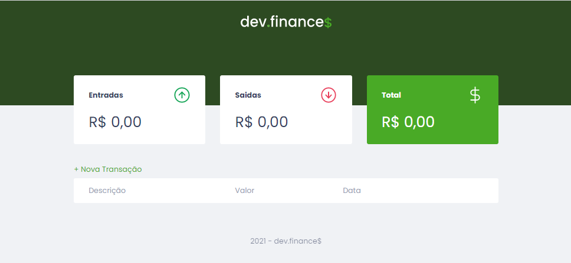

<h1>Aplicativo Dev.finances$</h1>
<h2>Desenvolvido na Maratona Discovery Rocketseat</h2>

<h2 align="center">App finalizado</h2>

<h3>Objetivo</h3>

O objetivo na criação do aplicativo dev.finance$ tem exclusiva finalizade de fixação do conhecimento adquirido nos cursos rápidos e gratuitos da plataforma Rocketseat.

<h3>Finalidade</h3>

A aplicação web que tem como principal finalidade a informação sobre o controle financeiro pessoal. Através dos lançamentos das despesas e recebimentos, o aplicativo armazena as informações e realiza o cálculo entre entradas e saídas de capital e informa o saldo, sendo positivo ou negativo.

A informação e controle financeiro é primordial para qualquer pessoa, sendo assim, utilize o palicativo de forma a aproveitar suas funcionalidades de forma gratuita e com as funcionalidades disponíveis.

<h3>Tecnologias</h3>

Tecnologias utilizadas na construção do aplicativo:

\- [HTML5](https://developer.mozilla.org/pt-BR/docs/Web/HTML)

\- [CSS3](https://developer.mozilla.org/pt-BR/docs/Web/CSS)

\- [JavaScrit](https://developer.mozilla.org/pt-BR/docs/Web/JavaScript)

Aplicativo finalizado e conhecimento fixado.

Desenvolvido por: Cezar Amorim - cezar.dba@gmail.com
